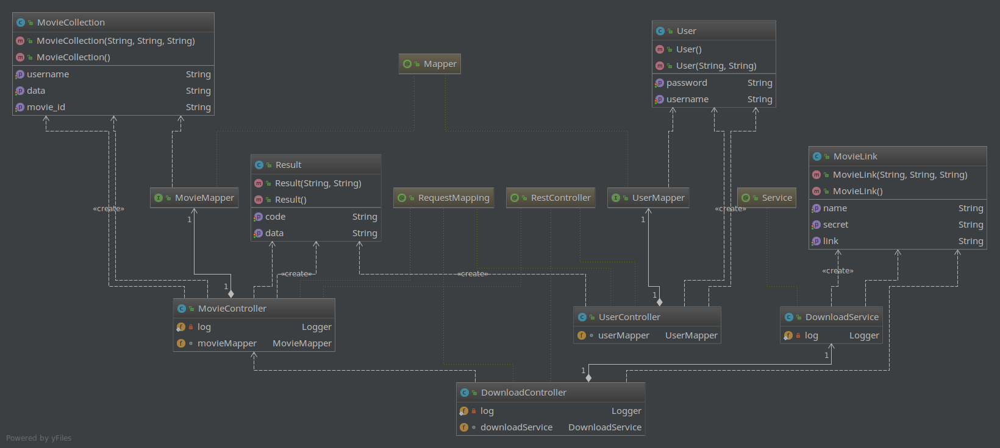

# VMovie(看电影)
## 一个电影分享收藏下载的App, 基于软件工程理论构建项目，从需求调研到概念设计，逻辑设计......到编码......测试......严格按照软件工程完成项目，从此跟那些peixunban不一样
### English Proposal for the App  

**1 Introduction**  
My project aims to implement a movie tracking app based on douban apis and using the crawler to get the download links. The app can browse the latest or the hottest movie brief information and movie charts and so on. Of course, you can get the detail information of the movie. You can also collect movies and download the movie to local.

**2 Techniques** 
1) Java and python programming language skills
2) Mysql DB 
3) Android device
4) Linux cloud server

**3 Working plan**
1) First, get the apis, then fetch and clearing up the data
2) Second, design database for data.
2) Design restful apis for providing local data.
3) Crawler the download link.
3) Design and development of app.
4) Write the document and submit.
## Chinese Version
### 一、项目计划　
1. 先完成前期调研，在进行设计 
2. 本项目主要是基于现有的API获取数据，暂定目标网站api为豆瓣  
3. 从豆瓣获取的api可以获取到相关电影的详细信息，但无法拿到下载链接，这里将会使用爬虫手段到固定网址爬取，暂定目标网站为[6v](http://www.6vhao.tv)， 通过搜索api获取结果，再从结果界面获取下载链接  
4. 工具：  
	- Android Studio
	- MySQL数据库 
	- 阿里云ECS
	- SpringBoot 
	- OkHttp 爬虫 JSoup网页解析工具  
### 二、需求调研　
1. 数据传输需求有json和xml数据混合使用，需求中存在xml文件的解析，有与之对应的xsd文件，该部分将用于收藏数据的传输，
2. 首先有用户这一概念，所有数据均从API获取，不存于本地 用户界面包括登录， 注册， 首页， 收藏页， 电影详情页， 个人简单页， 关于 共七个页面
3. 其次有登录，注册界面，简单实现即可，无需复杂。注册输入用户名密码结，登录输入用户名密码即可，头像随机抽取一个，来源于app本身resource文件
4. 首页顶部有标签栏，区分不同类型的电影，标签栏下显示电影简略信息，包括图片，标题等。
5. 详情页提供电影的其他信息，包括评分，评论列表，提供下载链接，但不提供下载，需使用下载工具进行下载
6. 个人简单页有收藏入口，退出登录，关于等入口，
7. 收藏界与首页列表相似
8. 关于界面展示作者信息，github信息。 
### 三、概要设计
##### 1.总述
这是一款电影信息分享平台，主要从数据源获取数据并进行展示，基于用户系统，数据在服务端可以进行持久化。
##### 2.总体设计  
1.分层： 展示层， 业务层， 数据层，
2.数据层： 使用豆瓣api获取电影基本数据，使用Springboot构建自己的restapi,提供xml格式的数据，数据使用mysql存储。
3.业务层： 通过客户端的事件响应，从api获取数据并返回，处理业务逻辑
4.展示层： 将数据进入展示。
##### 3.API列表: 
	正在热映(返回json数据)
	GET /v2/movie/in_theaters  (count=?&start=?)
	即将上映(返回json数据)
	GET /v2/movie/coming_soon  (count=?&start=?)
	Top250(返回json数据)
	GET /v2/movie/top250   (count=?&start=?)
	北美票房榜(返回json数据)
	GET /v2/movie/us_box
	电影条目信息(返回json数据)
	GET /v2/movie/subject/:id    (1764796)
	添加收藏(自定义接口，返回json数据)
	POST /collection (post json数据)
	删除收藏(自定义接口，返回json数据)
	DELETE /:username/collection/:movie_id
	自定义收藏列表(自定义接口，返回xml数据)
	GET /:username/collections/
	下载链接获取(自定义接口，返回json数据)
	GET /search/:moviename(自定义接口，返回json数据)
	注册(自定义接口，返回json数据)
	POST /register 提交内容username passwd 进行加密处理
	登录(自定义接口，返回json数据)
	POST /login     提交内容id passwd 进行加密处理
### 四、详细设计　
#### 1. 数据库设计
**服务端数据库设计**(简单为主)
- user表　username(primary key), password(密文)
- movie_collections 表 username(primary key), movie_id(primary key), data(从豆瓣api获取的json数据)
#### 2. 模块设计
##### 2.1 整体架构  
客户端采用mvp设计模式搭建app,　服务端使用springboot, 数据库使用mysql
##### 2.2 后端设计

###### 2.2.1 使用springboot+mybatis对外提供服务接口
- 注册接口　POST /register 提交两个参数，username和password(密文),拦截到请求后执行插入数据库操作并返回结果.
- 登录接口　POST /login 提交两个字段，username和password,拦截后查询数据库是否匹配并返回结果。
- 添加收藏接口　POST /collection/ 提交两个字段，movie_id 和username, 拦截后获取字段信息插入数据库并返回结果。
- 查看收藏接口　POST /collections/:username  提交一个字段，查询数据库并返回结果列表，已xml格式数据返回
- 删除收藏接口　DELETE /collection  提交两个字段，movie_id 和username, 拦截后获取字段信息删除数据库字段并返回结果。
- 查找电影接口 /search/moviename 提交一个字段，moviename　返回一个列表
###### 2.2.2 XML Schama文件格式 (movie.xsd)
```
<?xml version="1.0" encoding="UTF-8"?>
<xs:schema xmlns:xs="http://www.w3.org/2001/XMLSchema"
targetNamespace="http://www.w3schools.com"
xmlns="http://www.w3schools.com"
elementFormDefault="qualified">
<xs:element name="movie">
  <xs:complexType>
    <xs:sequence>
      <xs:element name="id" type="xs:string"/>
      <xs:element name="data" type="xs:string"/>
    </xs:sequence>
  </xs:complexType>
</xs:element>
</xs:schema>
```
###### 2.2.3 XML 传输文件
```
<?xml version="1.0" encoding="UTF-8"?>
<movies xmlns="http://www.microsoft.com"
	xmlns:xsi="http://www.w3.org/2001/XMLSchema-instance"
	xsi:SchemaLocation="http://*movie.xsd">
<movie>
	<id>1111</id>
	<data>{.....}</data>
</movie>
<movie>
	<id>1112</id>
	<data>{.....}</data>
</movie>
</movies>
```
##### 2.3 Android端设计
###### 2.3.1 框架mvp
1.BaseView 定义baseView
```
public interface BaseView<T> {

    void setPresenter(T presenter);

}
```
2.BasePresenter 定义basePresenter
```
public interface BasePresenter {

    void start();

}
```
3.Contract 定义具体接口
```
public interface Contract {
    interface View extends BaseView<Presenter> {
    }    
    interface Presenter extends BasePresenter {
    }
}
```

#### 3. 界面设计(描述)
### 五、代码开发　　

### 六、测试　　


